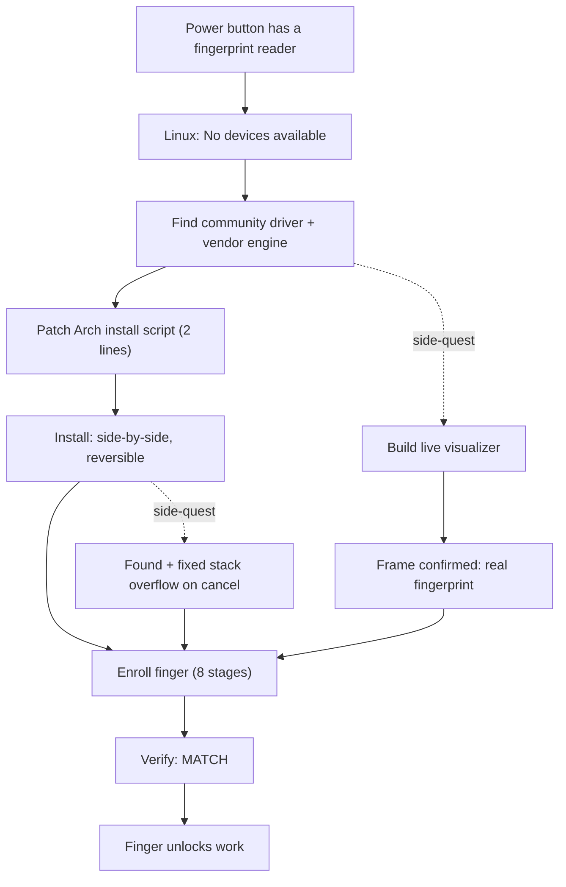
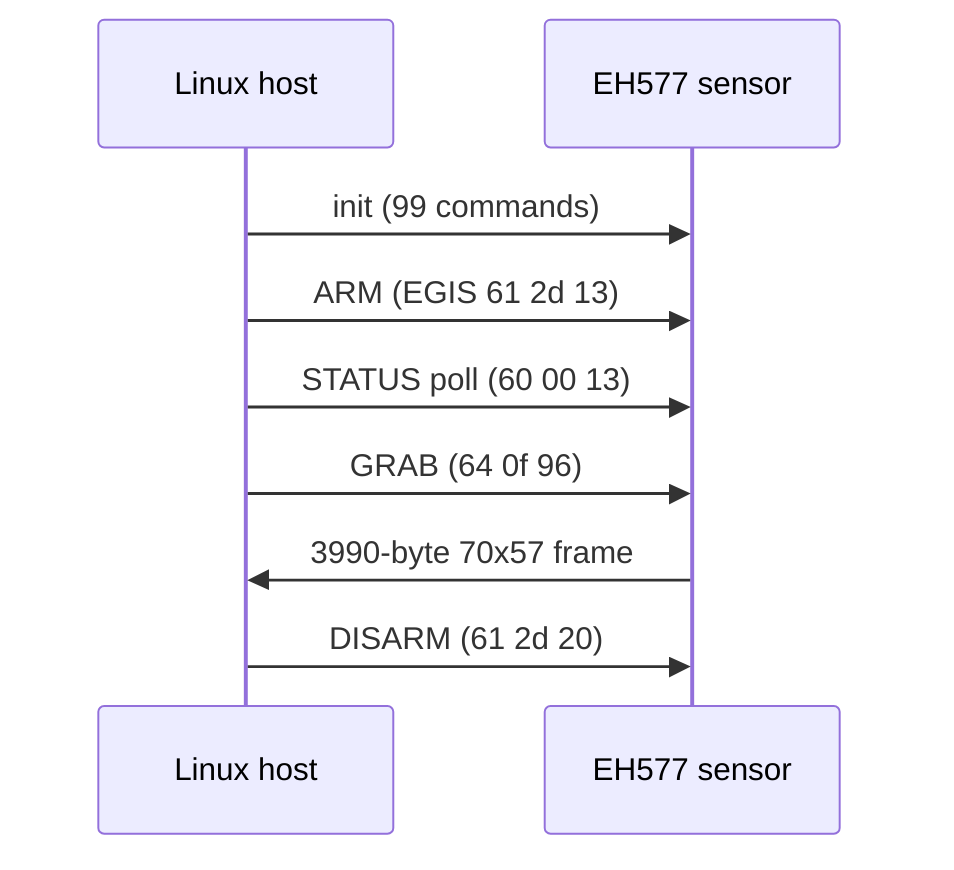
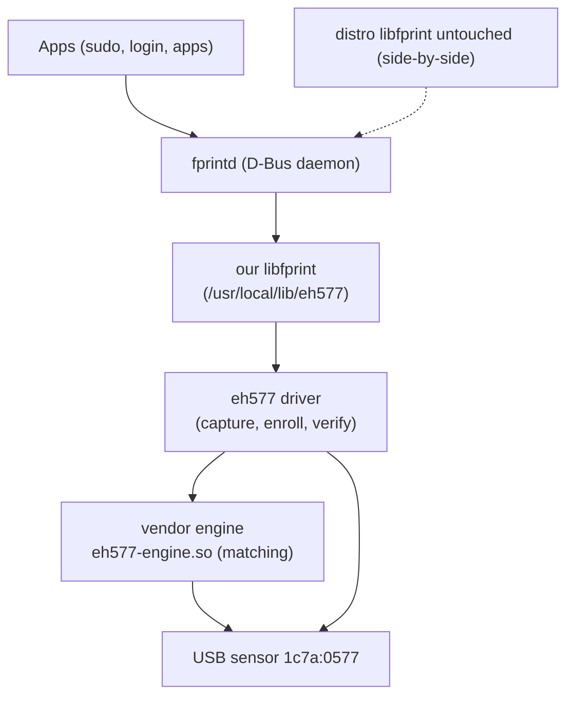

Press the power button on my desktop and you'll find a secret. The button has a fingerprint reader built into it. On Windows it worked, one touch and you're in. On Linux it sat dead, doing nothing. Not anymore. Today I rest my right index finger on the button and my computer unlocks. This is the story of how a person and a few AI agents worked together to bring that dead button to life.

Journey diagram (mermaid source)

## The Problem in Plain Words

Linux reads fingerprints through a library called libfprint. It's a big list of "how to talk to this reader" instructions, and almost every reader out there has an entry. Mine didn't. When I asked the system what fingerprint hardware it could see, it answered with three words: "No devices available."

The reader was physically there. I could see it in the hardware list under its proper name, EgisTec EH577, also known as part number 1c7a:0577. It lives inside the power button of my Beelink GTi15 Ultra, a small desktop computer with an Intel Core Ultra 9 processor. It just had no driver, no instructions, nothing that knew how to speak to it.

## How We Solved It

Writing a driver for a fingerprint reader is slow, fiddly work. Part of the trouble is the sensor itself. The EH577 is a "press" sensor. You hold a finger on it and it takes a single tiny picture: 70 by 57 pixels of grayscale, about 4,000 bytes of data. That's so small that open-source matching software struggles, failing roughly a third of the time.

Here's where the team came in. I'm the person with a problem. The AI agents are the workers. They captured USB traffic while the sensor was active, dug through hardware datasheets, and ran test commands against the live sensor. They found a community project, eh577-libfprint, that knows how to talk to this exact sensor. For the matching half, the project reuses the sensor maker's own engine, downloaded from Microsoft's driver archive and verified by checksum. No Windows software gets installed. The engine's logic is compiled into a Linux library, and everything runs natively.

Protocol diagram (mermaid source)

The conversation itself is short. The computer arms the sensor, checks its status, grabs a frame, and gets back the 70 by 57 picture. Then it disarms. Ninety-nine setup commands run first, and after that the dance is only four steps.

## The Install

Installing meant running one script with administrator rights. I typed the password, the human part of the job. The script puts our copy of the reader software next to the system's own copy, so the original stays untouched. It also installs a small rule that lets any logged-in user reach the sensor. An uninstall flag undoes everything.

Stack diagram (mermaid source)

But there was a catch, and it's my favorite part of this whole story. The install script was written for Fedora, which uses an extra security system called SELinux. I run Arch Linux, which doesn't have it. Two lines in the script assumed Fedora tools that simply don't exist here. The script runs in a strict mode where any failing command stops everything, so those two lines would have killed the install halfway through.

An agent caught it before I ever typed my password. It ran a practice pass, watched both lines fail, and showed me exactly what would happen. We patched the two lines to skip quietly when the tools are missing. The install then ran clean, end to end, no surprises.

## The Human Moment

The moment only a person can perform came next: I had to press my finger. Enrollment means holding your finger on the button for about fifteen seconds while the sensor takes eight samples. The screen ticked through all eight stages, and at the end it printed the words I wanted: "Enroll result: enroll-completed." The system now has my right index finger on file.

Then the real test. I pressed the button again and asked the system to check the print against what it stored. The answer: "Verify result: verify-match (done)." It matched. The fingerprint reader I thought was a dead button now recognizes me.

## The Visualizer Side-Quest

We didn't trust the hardware blindly. Before enrolling anything, the agents built a little viewer that shows what the sensor actually sees, rendered live in the terminal as a 70 by 57 grayscale image. When I pressed my finger, the picture showed clear, curved ridge lines. An AI vision agent studied one captured frame and judged it a genuine fingerprint with about 95% confidence.

That step matters more than it sounds. If the sensor had been feeding back garbage, enrollment would have locked in a fingerprint that never matches. Seeing the actual ridges first meant we were teaching the system a real fingerprint.

## The Crash We Found

The strangest moment came during testing. Cancelling a scan mid-way, by pressing Ctrl-C, crashed the driver hard. The agents pulled the crash dump apart and found the cause: a routine that kept calling itself, 261,000 frames deep, until the program ran out of stack space and died. The fix reroutes a cancelled scan through the error path instead of the success path. While in there, they fixed the same hidden flaw in the enroll and verify flows too.

## What You Get

Any program that speaks the standard fingerprint service can now use this sensor. My login screen uses that service, and the unlock works. Wiring it up for sudo and the lock screen is possible but optional, and I haven't flipped that on.

One honest note before you get excited. This sensor is tiny, only six to eight fingerprint ridges across. That makes it a convenience lock, not a strong security lock. Anyone serious about protecting this machine still needs the password. The fingerprint is for my hands when I'm here. The password is what keeps everyone else out.
