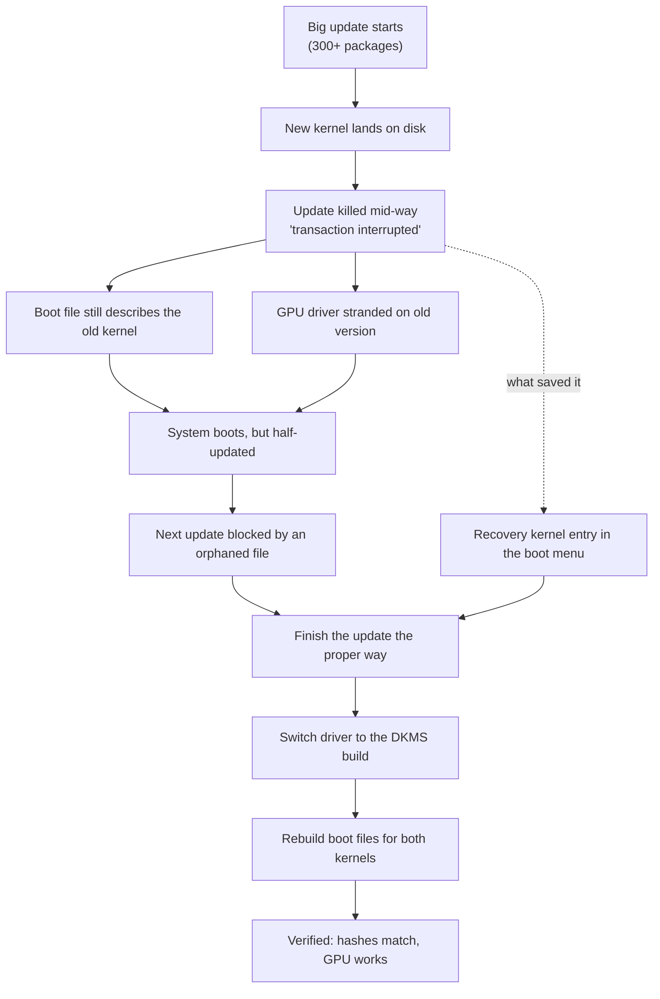
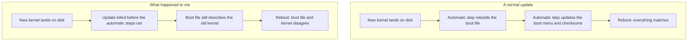

Updates are supposed to be the boring part of owning a computer. You press a button, wait a few minutes, and everything quietly gets newer. Mine didn't go that way. What followed was a chain of small disasters — a dead graphics card, a locked package manager, and boot files that stopped matching the system they were supposed to start. This is the story of how a routine update nearly broke my computer, and what it taught me.

Journey diagram (mermaid source)

## What Happened

I started a big system update. Roughly three hundred packages were on the list, including a brand-new kernel. The computer worked through them one by one, and then, about halfway through, the update simply stopped. No error message, no crash — the log's last line just said "transaction interrupted." Something had killed it mid-flight.

That's normally an annoyance you shrug off and retry. On this machine, it was the start of a long week.

## Why a Half-Finished Update Is Dangerous

To understand why, you need to know how my computer starts up. The motherboard doesn't read the system drive directly. It reads a small storage partition that contains **boot files** — one per kernel. Each boot file is a single bundle holding the kernel and the small tools needed to get the system running. After every kernel update, an automatic step rebuilds these bundles, and another automatic step updates the boot menu along with the checksums that verify each file.

Boot chain diagram (mermaid source)

My update died between those two steps. The new kernel was safely on disk, but the boot files still described the old one — a kernel that no longer existed. The boot file is a snapshot taken the moment the update finished, and mine was a snapshot of a ghost. This is the classic danger of a partial upgrade on a system like mine: the parts that actually start the computer are rebuilt by automatic steps, and if those steps never run, the boot files quietly go stale. Nothing checks for it afterward.

## The Graphics Card Went Dark

The same interrupted update stranded my NVIDIA driver. The driver package never got upgraded, and the old driver had been built for the old kernel. The new kernel refused to load it, so my graphics card sat there with no driver at all — no GPU monitoring, no hardware acceleration, nothing. The screen kept working only because the computer also has a built-in Intel graphics chip, which quietly carried the display while the big card sulked.

## And Then the Package Manager Locked Up

When I finally tried to finish the update, it refused with a cryptic error: *"file exists in filesystem."* One man page — a help file for an old command — was sitting on disk, owned by nobody. The new version of the package wanted to install that exact file, and the package manager refuses to overwrite anything it doesn't own. So one orphaned help file, a leftover from an earlier version, was blocking every single package operation on the whole system. A tiny, invisible detail had become a wall.

## What Saved the Day

The boot menu has a recovery entry — a fallback kernel that's always kept in working order. That entry, plus the snapshots the system takes before updates, meant there was always a way back in even if the main boot files misbehaved. It's the kind of safety net you never notice until you need it, and I needed it.

One honest note: the boot files were **stale, not corrupted**. Their checksums matched the files on disk perfectly. The system wasn't broken — it was just behind on its own story.

## The Fix

Four steps, each small, together thorough:

1. **Removed the orphaned file.** Verified that no package owned it, then deleted it. The package manager could breathe again.
2. **Finished the update the proper way.** My distribution has its own updater that takes a snapshot first, upgrades the packages, and then runs all the extra steps — including the boot file rebuilds — in the right order. The raw package manager doesn't do any of that; that's the whole point of the wrapper. The remaining sixty-odd packages went in cleanly.
3. **Switched the GPU driver to the DKMS build.** The regular driver ships pre-built for exactly one kernel — the one that existed when the package was made. The DKMS version builds itself for every kernel on the machine, automatically, whenever one changes. The recovery kernel gets the driver too, and this whole class of problem disappears.
4. **Rebuilt the boot files and verified the checksums.** Both kernels now boot with the driver baked in, the boot menu's checksums match the files, and the graphics card reports in healthy.

## What I Learned

- **Never interrupt a running update.** If one dies anyway, finish it before rebooting — the boot files are rebuilt by the steps that run at the very end.
- **Use the distribution's own updater.** It snapshots your system first, so you can roll back. The raw package manager just moves files.
- **After a partial update, check the boot chain, not just the packages.** "Did the packages install?" is the wrong question. The right one is "do the files that start the computer still match what's installed?"
- **On this machine, the DKMS driver is the right choice.** Pre-built drivers are convenient until the kernel moves on without them.

One thing I'm still watching: the reboot logged a non-fatal CPU hardware warning. It hasn't come back since, and it wasn't caused by the update, but it's the kind of thing worth keeping an eye on.

The computer is healthy again — packages consistent, boot files matching, GPU working on both kernels. Updates are supposed to be the boring part of owning a computer. After this week, I appreciate the boredom.
